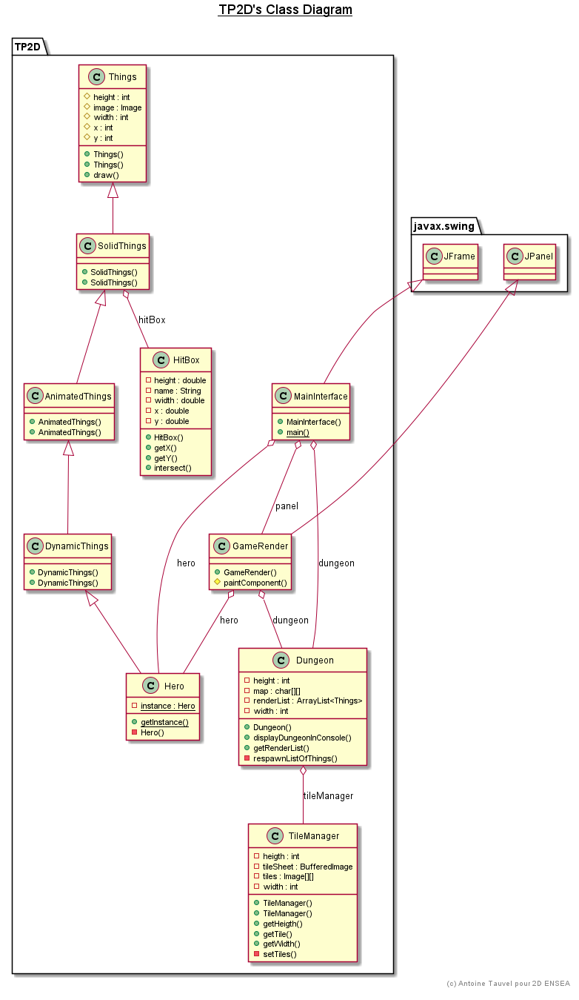

# Projet pédagogique pour alternant 2D

Développé à l'hiver 2023

Ce TP est constitué de 4 séances de découverte de la POO suivis de deux séances de conception.

Lucas :

Monsieur TAUVEL,

Je tenais à vous faire part du travail accompli lors de nos travaux pratiques de Java en binôme avec Aurélien Denizet.

Nous sommes fiers de vous annoncer que nous avons été les seuls de notre groupe de TP3 à réussir la structure du Donjon de Link.

Lorsque que j'ai été malade, j'ai pu contribuer à distance en ajoutant de la musique médiévale, en gérant la structure du Donjon et en affichant le ping en jeu.

Aurélien a également été très impliqué et a pris en charge les autres options demandées lorsque j'étais absent.

Nous restons disponibles pour toute question ou demande d'information supplémentaire.

Cordialement,

Aurelien : 

Pour ma part, Le projet Link s'est révélé être une expérience captivante, offrant une perspective pratique sur l'utilité de Java. En naviguant à travers le développement de ce projet, j'ai pu approfondir mes compétences en programmation orientée jeu.

Une des fonctionnalités clés du projet est la classe Dungeon, qui joue un rôle central dans la construction du monde du jeu. La classe Dungeon gère la disposition des éléments du jeu, tels que les murs, les ennemis et le héros, offrant une représentation structurée de l'environnement du jeu. Cette abstraction permet une manipulation efficace des objets du jeu et facilite la gestion des collisions, une fonction cruciale pour assurer le bon déroulement du jeu.

En résumé, le projet Link a été une expérience enrichissante, mettant en lumière l'application pratique de Java dans le domaine du développement de jeux.

